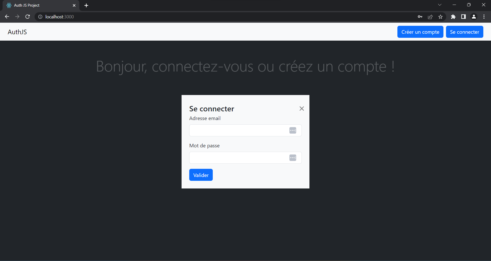
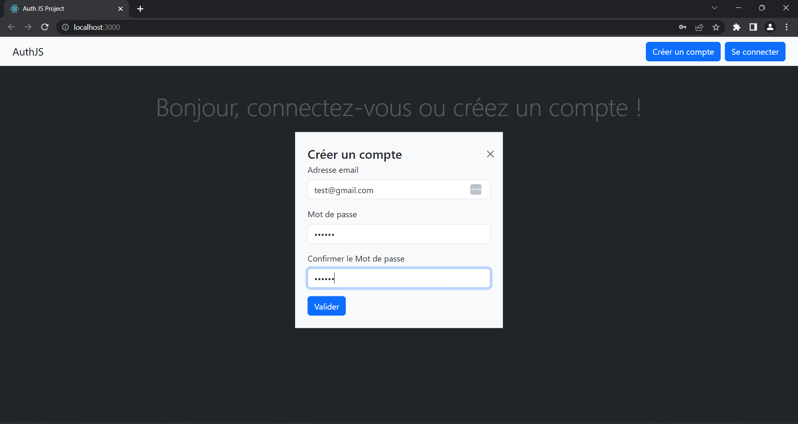
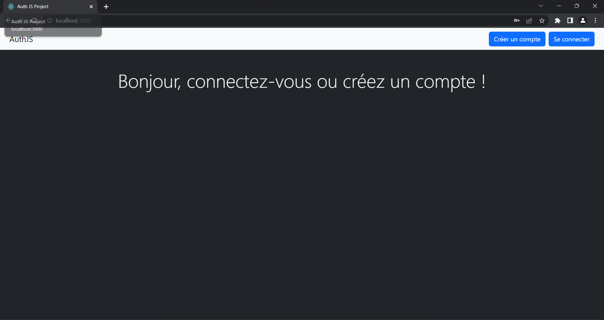
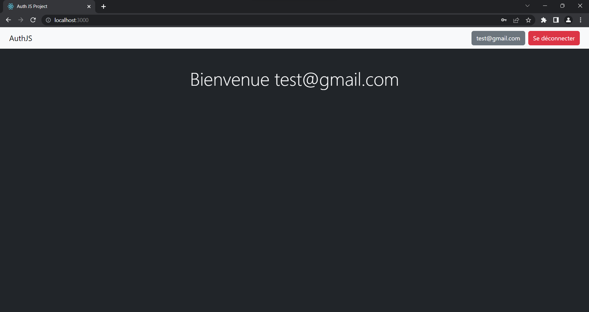

### Lien Github du projet

[https://github.com/alexandrebrgn/authProjectReactJSFirebase](https://github.com/alexandrebrgn/authProjectReactJSFirebase)

### Présentation rapide du projet

Comme le site n'est pas hebergé, voici quelques captures d'écran qui présentent le projet

##### Formulaire d'inscription

##### Formulaire de connexion

##### Accès à une route privé

L'accès à cette route privée est gérée par la technologie React Router v6.
On peut remarquer à droite dans la navbar la connexion de l'utilisateur

##### La page d'accueil si l'utilisateur est connecté

### 💼 | Compétences du projet

